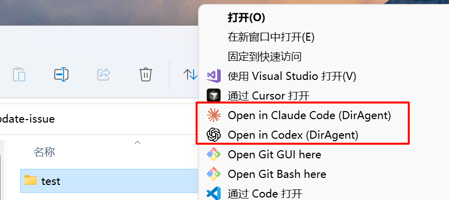

# 🚀 DirAgent

> 在文件管理器中右键一键启动 `Codex / Claude`，并自动进入目标目录。

🌐 语言: [中文](README.md) | [English](README.en.md)

## ✨ 概览

`DirAgent` 是一个目录上下文启动器。它把“打开终端 -> cd 到目录 -> 输入命令”这套重复动作，收敛成文件管理器里的一个右键动作。

安装后会新增：

- `Open in Codex (DirAgent)`
- `Open in Claude (DirAgent)`



## 🎯 背景与痛点

这个项目诞生于几个真实高频问题：

- 每天都要大量使用 `codex`,`claude code`等这样的 Agent CLI 工具，但每次都要手动打开终端并切目录，很烦 ！！
- 大部分人的使用习惯是通过操作系统自带的文件管理器来浏览打开文件，所以，最简单就是在浏览器过程一键启动 Agent CLI
- DirAgent 就是这个目的，在任何目录，右键一键开启 Agent(当前支持 codex, claude code)

## 🧠 工作原理

1. 安装脚本为系统注册目录级右键菜单。
2. 右键触发后，把目标目录交给 `diragent`。
3. `diragent` 根据 `config.toml` 解析工具、参数、终端和窗口策略。
4. 在目标目录中启动 `codex` 或 `claude`。

说明：

- 文件右键默认不显示菜单，这是有意设计（避免语义歧义）。
- `open_mode` 支持优先新 Tab 或强制新窗口。

## ✅ 功能特性

- 目录右键一键启动 Codex / Claude
- 目录范围显示策略（文件场景不显示）
- Windows Terminal 的 profile/shell 可配置（`powershell` / `cmd` / `cmder`）
- 默认工具参数可配置（支持高权限默认参数）
- 跨平台安装脚本（Windows / macOS / Linux）

## 🛠️ 安装

### 🪟 Windows

推荐：`bat` 一键方式

1. `scripts/diragent-1-build-and-verify.bat`  
   构建并执行 `go test ./...`
2. `scripts/diragent-2-install-right-click.bat`  
   安装 Explorer 右键菜单
3. `scripts/diragent-3-uninstall-right-click.bat`  
   卸载菜单并回滚

命令行方式（PowerShell）：

```powershell
# 安装
.\scripts\install.ps1

# 卸载
.\scripts\uninstall.ps1

# 卸载并清理 assets + config
.\scripts\uninstall.ps1 -RemoveAssets -RemoveConfig
```

### 🍎🐧 macOS / Linux

```bash
chmod +x ./scripts/install.sh ./scripts/uninstall.sh
./scripts/install.sh ./diragent
./scripts/uninstall.sh ./diragent
```

## 📦 Release 资产怎么用

Release 页里的可下载文件在 `Assets` 区域，不是 `Source code (zip/tar.gz)`。

按系统/架构选择：

- Windows x64: `diragent_v0.5_windows_amd64.exe`
- Windows ARM64: `diragent_v0.5_windows_arm64.exe`
- macOS Intel: `diragent_v0.5_darwin_amd64`
- macOS Apple Silicon: `diragent_v0.5_darwin_arm64`
- Linux x64: `diragent_v0.5_linux_amd64`
- Linux ARM64: `diragent_v0.5_linux_arm64`

可选校验（推荐）：

- 下载 `SHA256SUMS.txt`，校验二进制完整性。
- Windows (PowerShell): `Get-FileHash .\diragent_v0.5_windows_amd64.exe -Algorithm SHA256`
- macOS/Linux: `sha256sum ./diragent_v0.5_linux_amd64`

下载后二选一：

1. 直接用下载文件安装菜单（推荐）
   - Windows:
   ```powershell
   .\scripts\install.ps1 -BinaryPath .\diragent_v0.5_windows_amd64.exe
   ```
   - macOS/Linux:
   ```bash
   chmod +x ./diragent_v0.5_linux_amd64
   ./scripts/install.sh ./diragent_v0.5_linux_amd64
   ```
2. 重命名为 `diragent` / `diragent.exe` 放到 `PATH`，再执行安装脚本

## ▶️ 使用方式

1. 在目录或目录空白处右键。
2. 选择 `Open in Codex (DirAgent)` 或 `Open in Claude (DirAgent)`。
3. CLI 会在该目录下直接启动。

预期行为：

- 文件右键不显示 DirAgent 菜单。
- 如果当前终端不支持 Tab 复用，会自动回退到新窗口。

## ⚙️ 配置说明

配置文件路径：

- Windows: `%AppData%\dir-agent\config.toml`
- macOS/Linux: `~/.config/dir-agent/config.toml`

默认配置：

```toml
[terminals]
preferred = ""

[terminals.windows_terminal]
profile = ""
shell = "powershell"
cmder_init = ""

[tools.codex]
command = "codex"
default_args = ["--dangerously-bypass-approvals-and-sandbox"]

[tools.claude]
command = "claude"
default_args = ["--dangerously-skip-permissions"]

[behavior]
resolve_file_to_parent = true
open_mode = "tab_preferred"
```

核心概念：

- `tools.*`：定义“执行哪个命令”和“默认附带哪些参数”
- `terminals.*`：定义“用哪个终端承载启动”
- `behavior.*`：定义“路径与窗口策略”

常见配置场景：

1. 命令不在 `PATH`：设置 `tools.codex.command` / `tools.claude.command` 为绝对路径
2. 指定 Windows Terminal 的 profile/shell：设置 `terminals.windows_terminal.profile` 与 `shell`
3. 调整窗口策略：设置 `behavior.open_mode = "tab_preferred"` 或 `"new_window"`

Windows Terminal + Cmder 示例：

```toml
[terminals]
preferred = "windows-terminal"

[terminals.windows_terminal]
profile = "Cmder"
shell = "cmder"
cmder_init = "C:\\path\\to\\cmder\\vendor\\init.bat"
```

参数优先级（低 -> 高）：

1. 程序默认值
2. `config.toml` 中的 `default_args`
3. CLI `--` 之后透传参数

## 🧯 常见问题

### 报错 `2147942402 (0x80070002)`

通常表示命令未找到：

1. 在 PowerShell 执行 `Get-Command codex`
2. 在配置里修正 `tools.codex.command`
3. 重新执行安装脚本

### 菜单安装后看不到

- 在文件夹空白处按 `F5` 刷新
- 或重启 Explorer
- 确认安装在当前用户范围（`HKCU`）

### 没有按预期开新 Tab

先确认 `behavior.open_mode = "tab_preferred"`。  
若终端不支持 Tab 复用，会自动回退到新窗口。

## 🧪 开发

```bash
go test ./...
```

```powershell
go build -o diragent.exe ./cmd/diragent
```

```bash
go build -o diragent ./cmd/diragent
```

## 🤝 贡献

欢迎提 Issue / PR，一起完善跨平台目录启动体验。

## 📄 许可证

MIT, see `LICENSE`.
